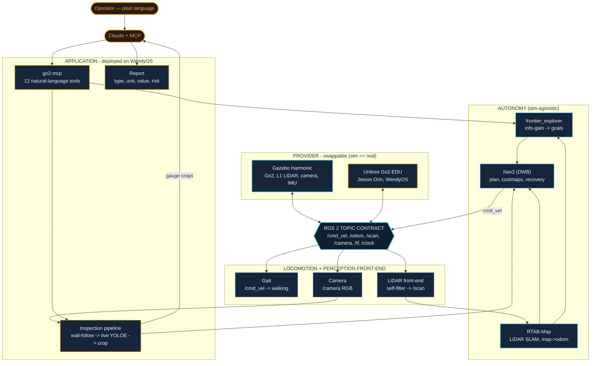
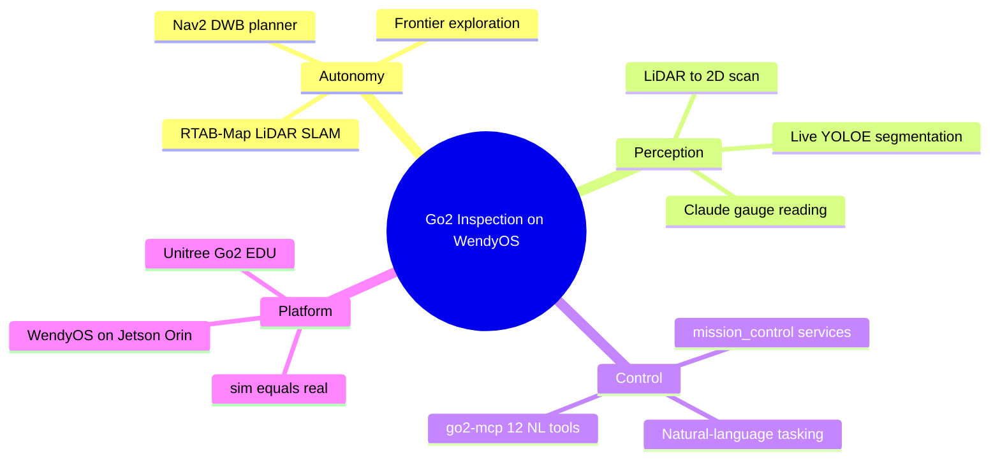

# Autonomous Go2 Inspection on WendyOS

**Tell the dog, in plain language, to inspect a facility — it explores autonomously, reads every gauge, flags faults, and writes the report.**

Built for the **Europe Embodied (EE26) 48-hour Hackathon** — *Wendy Challenge: Autonomous Quadruped Inspection* — by **Team 8bit**.
Target platform: **Unitree Go2 EDU** + **NVIDIA Jetson Orin** running **WendyOS**.

---

## What it does

A natural-language command (via Claude + MCP) drives a Unitree Go2 through a full industrial-inspection mission:

1. **NL command** — operator asks in plain English (Claude · MCP)
2. **Autonomous explore + map** — frontier exploration builds a SLAM map of the unknown facility
3. **Navigate to room** — Nav2 plans across the mapped facility
4. **Wall-follow scan** — map-driven wall follower strafes each wall, *facing it*
5. **Live YOLOE crops** — open-vocabulary segmentation runs **live** during the scan, stopping to capture a clean crop of every instrument
6. **Claude reads gauge** — each crop is read (type · unit · value) with a reasoning-first prompt
7. **Anomaly check** — needle-in-red / out-of-range gauges are flagged
8. **Report** — one structured inspection report per facility

> **The key idea — `sim == real`:** the *same* ROS 2 node graph runs in Gazebo simulation and on the real Go2. The autonomy stack depends only on standard ROS 2 topics (`/cmd_vel`, `/odom`, `/scan`, `/camera`, TF, `/clock`), so the graph that works in sim deploys unchanged on the Go2 via WendyOS. No ground-truth poses, no teleport, no cheats — only the robot's own sensors, SLAM, localization and planning.

See [`Go2-Inspection-Template.pptx`](Go2-Inspection-Template.pptx) for the pitch deck (architecture + live demo video).

---

## Architecture

> **`sim == real`** — one ROS 2 node graph runs in Gazebo and on the real Go2. The autonomy stack
> binds only to the standard ROS 2 topic contract, so the graph that works in simulation deploys
> unchanged on the Go2 via WendyOS. Swap the *provider* (Gazebo ⇄ Unitree Go2); everything below is identical.



### Capability map



---

## Repository layout

| Path | What |
|---|---|
| `go2-sim/go2_ws/src/` | The ROS 2 (Jazzy) workspace — all packages |
| &nbsp;&nbsp;`go2_bringup/` | Launch + config: sim, RTAB-Map SLAM, Nav2, mapping/inspection bringup |
| &nbsp;&nbsp;`go2_inspection/` | Wall-follower, YOLOE segmenter, gauge reader (Claude), mission orchestrator, **mission_control service layer**, **MCP server** |
| &nbsp;&nbsp;`go2_exploration/` | Frontier exploration + self-filter |
| &nbsp;&nbsp;`go2_zones/` | Map → room/zone auto-segmentation |
| &nbsp;&nbsp;`go2_worlds/` | Gazebo worlds (maze, facility) + gauge assets |
| &nbsp;&nbsp;`go2_description/`, `go2_config/`, `champ*/` | Go2 URDF/meshes + CHAMP gait (sim locomotion) |
| `go2-sim/maps/` | Map grids (`.pgm`/`.yaml`) + zones + helper scripts (RTAB-Map `.db` files excluded — too large) |
| `go2-sim/docs/`, `RUN-SIM.md` | Run guides + service catalog |
| `go2-sim/run_mcp_sim.sh` | Launcher for the natural-language MCP server |
| `apps/` | **WendyOS deployment** — `go2-ros2-bridge-only` (hardware contract) + `go2-autonomy` (the autonomy app), each a `wendy.json` + Dockerfile |
| `Go2-Inspection-Template.pptx` | Pitch deck |

---

## Run it (simulation)

ROS 2 **Jazzy** + Gazebo **Harmonic**. Build the workspace:

```bash
cd go2-sim/go2_ws
colcon build --symlink-install
source install/setup.bash
export FASTDDS_BUILTIN_TRANSPORTS=UDPv4    # DDS over UDP (stable shm-free discovery)
```

**Mode A — autonomous mapping + exploration**

```bash
# sim + RTAB-Map SLAM + Nav2 (Nav2 staged after the map frame exists)
ros2 launch go2_bringup sim_mapping.launch.py world:=maze.sdf headless:=false
# drive the frontier explorer
ros2 run go2_exploration frontier_explorer --ros-args -p use_sim_time:=true -p autostart:=true -p robot_base_frame:=base_link
```

**Mode B — inspection on a saved map**

```bash
cp ~/.go2_maps/maze.db ~/.ros/rtabmap.db                                   # load the map for localization
ros2 launch go2_bringup inspection_nav.launch.py world:=maze.sdf map_yaml:=~/.go2_maps/maze_map.yaml headless:=false
ros2 launch go2_bringup mission_control.launch.py zones_file:=~/.go2_maps/maze_zones.yaml map_name:=maze
ros2 service call /inspect_zone go2_inspection_interfaces/srv/ZoneTask "{zone_id: zone_3, read: false}"
```

**Natural-language control (Claude CLI + MCP)** — wraps the 12 mission-control services as tools:

```bash
claude mcp add go2-sim -- "$PWD/go2-sim/run_mcp_sim.sh"
# then, in a Claude session:  "explore the maze, then inspect zone 3 and show me the gauges"
```

The 12 tools: `start/stop_exploration`, `save_map`, `navigate_to_zone`, `navigate_home`, `inspect_zone`, `run_mission`, `list_zones`, `get_zone_image`, `get_zone_gauges`, `get_report`, `get_status`.

---

## Tech stack

ROS 2 Jazzy · Gazebo Harmonic · CHAMP (sim gait) · RTAB-Map (LiDAR SLAM) · Nav2 (DWB) · frontier exploration · YOLOE (open-vocab segmentation) · Claude (Haiku/Opus) + MCP · WendyOS / Jetson Orin · Unitree Go2 EDU.

## Team

**8bit** — EE26 Hackathon (Europe Embodied), Munich/Freising, June 2026.
