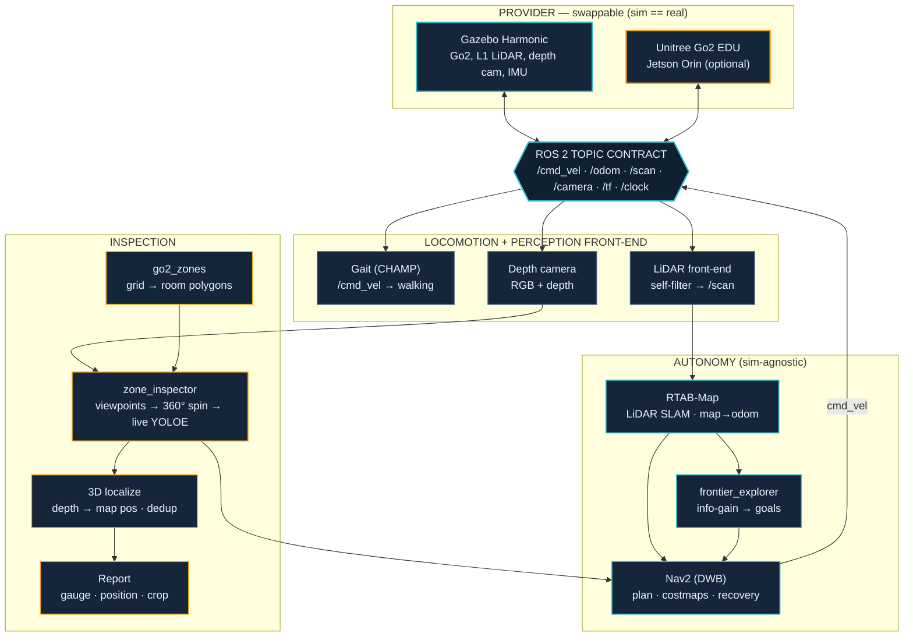

# Autonomous Quadruped Inspection

[](https://github.com/Manas-arumalla/autonomous-go2-inspection/actions/workflows/ci.yml)
[](https://docs.ros.org/en/jazzy/)
[](https://gazebosim.org/)
[](LICENSE)

**A Unitree Go2 maps an unknown facility, finds every gauge, localizes each one in 3D, and writes an
inspection report — fully autonomously, from its own sensors, with no ground-truth poses and no shortcuts.**

Built on **ROS 2 Jazzy + Gazebo Harmonic** with a **sim-agnostic autonomy stack** (RTAB-Map SLAM · Nav2 ·
frontier exploration · open-vocab detection). The same ROS 2 node graph that runs in simulation deploys
unchanged on the real Go2 (`sim == real`), so the simulator is a swappable *provider*, not the product.

> One command brings up the whole thing: **`./go2-sim/run_demo.sh`** → Gazebo + RViz + SLAM + Nav2 + the
> service layer, ready for a mission. Gazebo shows the physical scene; RViz shows the robot's map,
> costmaps, planned path, camera feed, and the 3D-localized gauge detections.

---

## Results

Benchmarked against the world's ground-truth gauge poses (`go2_inspection benchmark`) — the robot never
sees ground truth; it's used only to *score* the run.

| Metric | Result |
|---|---|
| **Gauge recall** (found / present) | **4 / 4** |
| **Precision** (after de-duplication) | **4 / 4** (F1 = 1.0) |
| **Mean 3D localization error** | **~0.1 m** |
| **Full autonomous mission** | HOME → 4 rooms inspected → return HOME, unattended |
| **Unit tests / CI** | **38 passing**, GitHub Actions on the ROS-free core |

Detection and localization are **run-to-run consistent** and reached through principled sensing fixes, not
threshold tuning — see [Engineering depth](#engineering-depth).

---

## What it does

From HOME, with no prior map, the robot runs a full industrial-inspection mission end to end:

1. **Explore & map** — frontier exploration drives Nav2 to autonomously build a SLAM map of the unknown facility.
2. **Segment into rooms** — the occupancy grid is watershed-segmented into room polygons (zones).
3. **Navigate room-to-room** — Nav2 plans across the mapped facility; a wedge-recovery layer keeps it moving.
4. **Detect** — at each room it samples safe viewpoints and does a 360° spin running **live open-vocabulary
   YOLOE** detection.
5. **Localize in 3D** — every detection is projected to a **map position** through the depth camera, then
   de-duplicated and persistence-filtered across the whole room.
6. **Report** — a per-room + facility report (each gauge, its 3D position, a crop); the gauge *value* can be
   read by a vision model from the crops.

> **No shortcuts.** No ground-truth poses, no teleporting, no hardcoded gauge locations — only the robot's
> own LiDAR, depth camera, SLAM, localization and planning.

---

## Quick start

```bash
git clone https://github.com/Manas-arumalla/autonomous-go2-inspection.git
cd autonomous-go2-inspection/go2-sim/go2_ws
colcon build --symlink-install && source install/setup.bash

# ONE command — Gazebo + RViz + SLAM + Nav2 + the control layer, on the maze world:
cd .. && ./run_demo.sh

# ...then run the full autonomous inspection mission (also: ./run_demo.sh mission:=true):
export FASTDDS_BUILTIN_TRANSPORTS=UDPv4
ros2 run go2_inspection inspection_mission --ros-args -p use_sim_time:=true \
  -p zones_file:=$HOME/.go2_maps/maze_zones.yaml -p map_yaml:=$HOME/.go2_maps/maze_map.yaml

./stop_demo.sh   # clean teardown

# Mapping-from-scratch, individual components, and the natural-language path: go2-sim/RUN-SIM.md
```

Prerequisites: ROS 2 Jazzy, Gazebo Harmonic. Detection weights are documented in `go2-sim/RUN-SIM.md`
(the stack degrades gracefully to navigate-and-spin if they're absent).

The demo **localizes on a pre-built map**. The maze's 2D occupancy map ships with the repo; the RTAB-Map
localization database is large and is not committed, so on a fresh clone build it once by mapping the maze
in SLAM mode and saving it (see `go2-sim/RUN-SIM.md`, mapping mode) before running the localization demo.

---

## Architecture — `sim == real`

The autonomy stack binds only to the standard ROS 2 topic contract (`/cmd_vel`, `/odom`, `/scan`,
`/camera`, TF, `/clock`). Swap the *provider* (Gazebo ⇄ Unitree Go2) and everything above the bus is
identical — so a graph validated in sim deploys unchanged on hardware.



---

## Engineering depth

The interesting part isn't the happy path — it's making it **reliable and honest** on a resource-loaded
machine. Two write-ups document the debugging and the principled fixes:

- **[Reliability hardening (ADR-019)](go2-sim/docs/08-RELIABILITY-HARDENING.md)** — a chain of six failure
  modes found by running the full mission under contention: the mission conflating *"not localized yet"*
  with *"every zone unreachable"* (→ a **localization gate**), mid-mission localization loss under CPU
  starvation (→ TF-lag tolerance + recovery), a self-inflicted orphan clock bridge, the Nav2 activation
  race, and a doorway wedge (→ **retry-via-HOME** + fast wedge detection).
- **[Detection robustness (ADR-020)](go2-sim/docs/09-DETECTION-ROBUSTNESS.md)** — making detection
  **consistent** honestly: recall 3/4→4/4 by fixing a depth-localization gate that was too strict
  for small/distant objects (an **absolute valid-pixel floor**, not a fraction of a tiny patch), and
  precision→4/4 via an **observation-aware consolidation** that folds a weak localization ghost into its
  strong parent — guarded so two distinct gauges never merge (recall-safe), with unit tests.

Design decisions and the development history: [`go2-sim/docs/`](go2-sim/docs/) and
[`go2-sim/CHANGELOG.md`](go2-sim/CHANGELOG.md).

---

## Tech stack

**ROS 2 Jazzy** · **Gazebo Harmonic** · **RTAB-Map** (pure-LiDAR graph SLAM) · **Nav2** (DWB) ·
**frontier_explorer** (C++) · **CHAMP** gait · **YOLOE** open-vocab detection · **OpenCV** ·
**pytest + GitHub Actions**. Optional: a `mission_control` service layer + MCP server for
natural-language control, and deployment to the real Go2 via WendyOS (`apps/`).

## Repository layout

| Path | What |
|---|---|
| [`go2-sim/`](go2-sim/) | **The simulation + autonomy workspace — the project.** |
| `go2-sim/go2_ws/src/go2_inspection/` | Inspection pipeline: `zone_inspector`, `inspection_mission`, benchmark, planner. |
| `go2-sim/go2_ws/src/go2_bringup/` | Launch files, Nav2 + RTAB-Map config, the RViz view. |
| `go2-sim/docs/` · `go2-sim/CHANGELOG.md` | ADRs, design decisions, development history. |
| `apps/` | Optional WendyOS hardware-deployment path (the same graph on a real Go2). |

## License

MIT — see [LICENSE](LICENSE). Vendored third-party ROS 2 packages (CHAMP and the Go2 description/config
packages) retain their own licenses.

*A standalone simulation project for autonomous quadruped inspection.*
